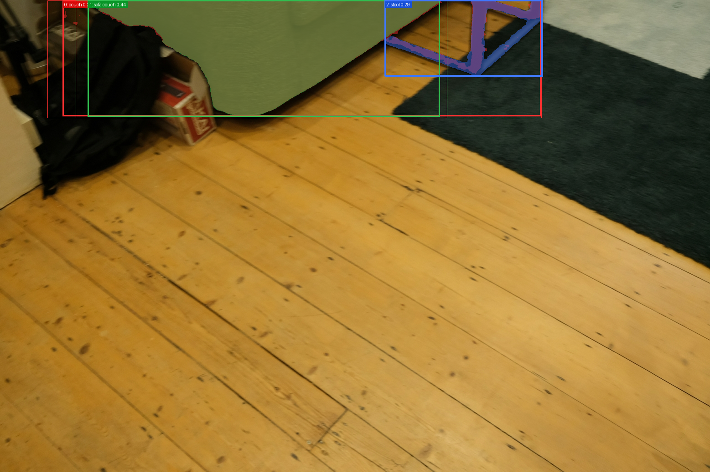
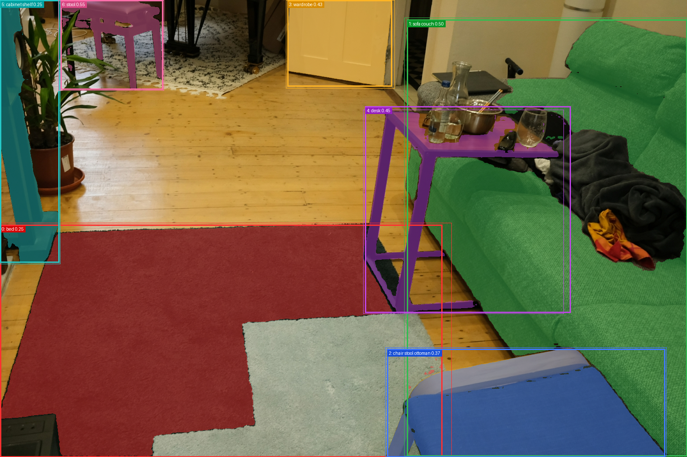
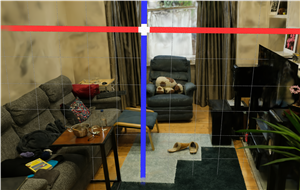
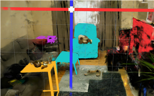

# GSegmenter

> GroundingDINO/SAM2 + 3D Gaussian Splatting 기반 객체 단위 3D 장면 분리 및 편집 연구 프로토타입

GSegmenter는 **3D Gaussian Splatting**(3DGS)의 고속 렌더링 성능과 **GroundingDINO/SAM2**의 객체 탐지 및 분할 능력을 결합하여, 정적인 3D 장면을 객체 단위로 이해하고 편집할 수 있도록 실험한 연구 프로토타입입니다.

기존 3DGS는 실제 사진에 가까운 품질의 장면 재구성과 빠른 렌더링을 제공하지만, 장면을 객체 단위로 분리하거나 특정 가구만 이동/삭제하는 기능은 기본적으로 제공하지 않습니다. GSegmenter는 이 한계를 보완하기 위해 멀티뷰 이미지에서 얻은 2D 객체 마스크를 3D Gaussian 공간으로 lifting하고, Gaussian Grouping 및 identity-aware training 구조를 통해 개별 객체를 조작 가능한 단위로 구성하는 것을 목표로 합니다.

본 저장소는 완성형 상용 인테리어 시뮬레이터가 아니라, 실제 공간 기반 인테리어 시뮬레이터로 발전시키기 위한 **핵심 파이프라인과 검증 도구**를 포함합니다.

---

## 프로젝트 상태

현재 구현된 내용:

- NerfStudio/Splatfacto 기반 3DGS 장면 준비 및 학습 래퍼
- GroundingDINO + SAM2 기반 2D 객체 마스크 추출 파이프라인
- 2D 마스크 evidence를 3D Gaussian 공간으로 연결하는 lifting 모듈
- Gaussian identity/grouping 관련 유틸리티
- identity-aware training을 위한 embedding, classifier, label dataset, loss, regularization scaffold
- PLY, NumPy, JSON 형태의 결과 export 도구
- Gaussian group preview, highlight, visualization 도구
- 객체 transform, 삭제/보정 관련 editor 기반 모듈과 테스트

부분적으로 구현되었거나 검증 중인 내용:

- grouped Gaussian을 이용한 객체 단위 편집
- UnityGaussianSplatting 기반 결과 확인
- identity-aware NerfStudio 학습 통합

아직 완성되지 않은 내용:

- 최종 사용자용 실시간 인테리어 시뮬레이터 UI
- 클릭 기반 객체 선택, 이동, 회전, 삭제 인터페이스
- 객체 삭제 이후 고품질 geometric infilling
- mIoU 0.8 이상 목표에 대한 체계적인 정량 평가
- 일반 사용자 배포용 설치 및 실행 패키징

---

## 기술 배경

### 3D Gaussian Splatting

3D Gaussian Splatting(3DGS)은 3D 장면을 삼각형 mesh가 아니라 수많은 작은 Gaussian primitive로 표현하는 기술입니다. 각 Gaussian은 위치, 크기, 방향, 색상, 투명도 정보를 가지며, 이를 이용하면 실제 사진에 가까운 품질의 장면을 빠르게 렌더링할 수 있습니다.

본 프로젝트에서는 실제 방 또는 실내 공간을 실사 수준으로 복원하기 위한 3D 표현 방식으로 3DGS를 사용합니다.

### GroundingDINO

GroundingDINO는 텍스트 프롬프트를 기반으로 이미지 안의 객체 위치를 찾는 open-vocabulary detection 모델입니다. 예를 들어 `chair`, `table`, `sofa`와 같은 단어를 입력하면 이미지 안에서 해당 객체의 bounding box를 예측할 수 있습니다.

본 프로젝트에서는 사용자가 지정한 객체 후보 영역을 찾기 위해 GroundingDINO를 활용합니다.

### SAM2

SAM2(Segment Anything Model 2)는 이미지 또는 영상에서 객체 영역을 픽셀 단위 마스크로 분할하는 모델입니다. GroundingDINO가 찾은 bounding box를 SAM2에 전달하면, 해당 객체 영역을 더 정밀한 segmentation mask로 얻을 수 있습니다.

본 프로젝트에서는 GroundingDINO + SAM2 조합을 통해 텍스트 기반 객체 탐지와 정밀 마스크 생성을 함께 사용합니다.

### Gaussian Center

Gaussian center는 3DGS에서 각 Gaussian primitive의 중심 좌표 `(x, y, z)`를 의미합니다. 본 프로젝트에서는 이 중심 좌표를 각 카메라 이미지 평면에 투영하고, 투영된 픽셀이 어떤 2D 객체 마스크 안에 포함되는지 확인하여 Gaussian별 객체 vote를 누적합니다.

### Gaussian Grouping

Gaussian Grouping은 3DGS에 객체 수준 의미를 부여하는 핵심 개념입니다.

기존 Gaussian은 주로 장면의 geometry와 appearance를 표현하는 데 집중하지만, Gaussian Grouping에서는 각 Gaussian이 **object identity** 또는 **group membership**에 대한 표현도 함께 가집니다. 이 representation은 2D mask supervision과 multiview consistency를 통해 학습되며, 서로 다른 시점에서 관측된 동일 객체를 하나의 coherent group으로 정렬하는 역할을 수행합니다.

이 접근은 다음과 같은 장점을 가집니다.

- 3D annotation 없이 object-level grouping 가능
- open-world scene에 대한 유연한 segmentation
- 학습 후 grouped Gaussian을 바로 편집 단위로 활용 가능
- removal, recoloring, recomposition 등 downstream editing으로 확장 가능

---

## 구현된 파이프라인

### 1. Data Acquisition

입력 이미지는 COLMAP을 통해 카메라 포즈와 sparse point cloud로 정렬되며, 이는 이후 Gaussian Splatting 학습의 기하적 초기 조건으로 사용됩니다.

### 2. 3D Gaussian Splatting Training

NerfStudio 기반 Splatfacto 학습 절차를 통해 장면을 구성하는 Gaussian의 위치, 크기, 공분산, 색상, opacity 등을 최적화합니다.

### 3. GroundingDINO + SAM2 Mask Extraction

각 입력 뷰에 대해 GroundingDINO로 텍스트 프롬프트 기반 객체 후보를 찾고, SAM2로 해당 객체의 2D segmentation mask를 생성합니다.

### 4. Identity Lifting and Gaussian Grouping

생성된 2D mask는 카메라 파라미터를 이용해 3D Gaussian 공간으로 대응됩니다. 각 Gaussian center를 이미지 평면에 투영하고, 투영점이 어떤 2D mask 내부에 위치하는지 확인하여 Gaussian별 identity evidence 또는 object vote를 누적합니다.

이후 multiview voting, spatial consistency, identity-aware training 구조를 통해 동일 객체에 속하는 Gaussian들이 하나의 coherent group으로 정리될 수 있도록 합니다.

### 5. Export and Visualization

Gaussian identity/grouping 결과는 PLY, NumPy, JSON 형태로 저장할 수 있으며, SuperSplat, UnityGaussianSplatting 또는 제공된 visualization 도구를 통해 확인할 수 있습니다.

### 6. Editing Prototype

그룹화된 Gaussian은 편집 가능한 scene entity로 취급될 수 있습니다. 현재는 객체 group 단위 transform, 삭제, repair를 위한 기반 모듈과 테스트가 포함되어 있으며, 최종 사용자용 실시간 UI는 향후 과제입니다.

---

## 수행 결과 요약

본 프로젝트는 완성형 end-user 애플리케이션보다 객체 단위 3DGS 편집을 위한 핵심 기술 파이프라인 구축에 초점을 맞추었습니다.

주요 결과:

1. 실내 장면을 NerfStudio 호환 데이터셋으로 준비하고 Splatfacto/3DGS 학습에 사용할 수 있는 구조를 마련했습니다.
2. GroundingDINO와 SAM2를 결합하여 `chair`, `table`, `sofa`, `storage` 등 텍스트 프롬프트 기반 실내 객체 마스크를 생성했습니다.
3. 2D 마스크 결과를 3D Gaussian 공간으로 lifting하여 Gaussian별 객체 evidence를 누적하는 구조를 구현했습니다.
4. Gaussian별 identity embedding, classifier, label dataset, supervision, spatial consistency regularization 등 identity-aware training 기반 모듈을 구현했습니다.
5. 카테고리별 identity 결과를 PLY, NumPy, JSON 형태로 export하고, highlight/preview 도구로 시각적으로 검증할 수 있게 했습니다.
6. UnityGaussianSplatting 및 SuperSplat과 같은 외부 viewer를 통해 Gaussian group 결과와 객체 이동 가능성을 확인했습니다.

---

## 결과 예시

### GroundingDINO + SAM2 기반 2D 객체 마스크 생성 결과

GroundingDINO로 텍스트 프롬프트에 해당하는 객체 후보 영역을 찾고, SAM2로 해당 객체 영역을 픽셀 단위 마스크로 분할한 결과입니다.

| 예시 1 | 예시 2 |
| --- | --- |
|  |  |

### 3DGS 공간 내 객체 분류 결과

2D 마스크 기반 identity/grouping 결과를 3D Gaussian 공간에 적용한 뒤, SuperSplat viewer에서 객체 분류 및 그룹 결과를 확인한 예시입니다.

| 예시 1 | 예시 2 |
| --- | --- |
|  |  |

---

## 시스템 구조

| Module | Description |
| --- | --- |
| `gsegmenter/data/` | COLMAP, NerfStudio scene, video preprocessing 관련 코드 |
| `gsegmenter/training/` | NerfStudio/Splatfacto training adapter, identity-aware training scaffold |
| `gsegmenter/segmentation/` | SAM2, GroundingDINO/SAM2 mask extraction |
| `gsegmenter/mapping/` | 2D-to-3D identity lifting, voting, grouping, evaluation |
| `gsegmenter/editor/` | Gaussian group transform, occupancy, repair 기반 모듈 |
| `gsegmenter/render/` | projection 및 rendering helper |
| `scripts/` | 주요 실행 entry point |
| `tools/` | PLY export, group highlight, preview, diagnostic utility |
| `configs/` | dataset, training, mapping, editor 설정 |
| `tests/` | projection, grouping, identity, editor 관련 테스트 |

---

## 목표 편집 시나리오

GSegmenter는 최종적으로 다음과 같은 객체 중심 편집 시나리오를 지원하는 것을 목표로 합니다. 현재 저장소는 이를 위한 기반 모듈과 검증 도구를 포함하며, 완성형 UI는 향후 과제입니다.

- **Object Selection**: 장면에서 특정 객체를 클릭하거나 선택해 해당 Gaussian group을 활성화합니다.
- **Object Translation / Rotation**: 선택된 group에 transformation matrix를 적용해 위치와 방향을 바꿉니다.
- **Object Removal**: 선택 객체를 scene representation에서 제거해 장면을 정리합니다.
- **Scene Recomposition**: 여러 Gaussian group을 재배치해 장면 구성을 바꿉니다.
- **Appearance Editing**: grouped representation을 활용해 색상 변경이나 style-aware editing으로 확장할 수 있습니다.

---

## 시작하기

### 요구 환경

- Python 3.10+
- CUDA 11.8 또는 12.1
- NVIDIA GPU 권장(RTX 30/40 series)
- NerfStudio
- PyTorch
- SAM2
- GroundingDINO
- COLMAP

### 설치 예시

```bash
cd GSegmenter

conda create -n gsegmenter python=3.10 -y
conda activate gsegmenter

pip install torch torchvision torchaudio --index-url https://download.pytorch.org/whl/cu118
pip install nerfstudio
pip install -r requirements.txt
```

SAM2는 NerfStudio/gsplat 환경과 PyTorch 버전 충돌이 날 수 있으므로 별도 가상환경 사용을 권장합니다.

```bash
conda create -n gsegmenter-sam2 python=3.10 -y
conda activate gsegmenter-sam2
pip install -r requirements-sam2.txt
```

---

## 데이터 및 체크포인트

대용량 파일은 GitHub 저장소에 포함하지 않습니다.

제외되는 항목:

- 촬영 영상 및 학습 데이터셋
- NerfStudio/3DGS checkpoint
- SAM2, GroundingDINO model weight
- export된 PLY 파일
- NumPy identity array
- 생성된 output, render, temporary artifact

로컬에서는 다음 경로를 사용합니다.

- `data/`
- `checkpoints/`
- `outputs/`
- `exports/`

위 경로들은 `.gitignore`에 의해 Git 추적 대상에서 제외됩니다.

---

## 예시 워크플로우

### 1. 영상 또는 이미지 데이터 준비

실제 방 촬영 영상이 있는 경우 NerfStudio 형식의 dataset으로 변환합니다.

```bash
python scripts/prepare_video_scene.py \
  --video-path captures/my_room.mp4 \
  --data-root data \
  --scene-name my_room \
  --num-frames-target 300 \
  --matching-method sequential \
  --sfm-tool colmap
```

### 2. 3DGS 학습

```bash
python scripts/train_splatfacto.py \
  --data-path data/my_room \
  --scene-name my_room
```

### 3. SAM2 마스크 추출

```bash
python scripts/run_sam2_masks.py \
  --python-bin C:\envs\sam2\Scripts\python.exe \
  --images-dir data/my_room/images \
  --output-root outputs/my_room/masks \
  --checkpoint-path checkpoints/sam2.pt \
  --model-config sam2_hiera_l.yaml
```

### 4. GroundingDINO + SAM2 마스크 추출

```bash
python scripts/run_grounded_sam2_masks.py \
  --python-bin C:\envs\sam2\Scripts\python.exe \
  --images-dir data/my_room/images \
  --output-root outputs/my_room/grounded_masks \
  --sam2-checkpoint-path checkpoints/sam2.1_hiera_small.pt \
  --sam2-model-config sam2_hiera_s.yaml \
  --detector-backend groundingdino \
  --grounding-checkpoint-path checkpoints/groundingdino_swint_ogc.pth \
  -- --prompt "chair . table . sofa . storage"
```

### 5. 2D 마스크를 3D Gaussian으로 lifting

```bash
python scripts/lift_masks_to_gaussians.py \
  --dataset-root data/my_room \
  --ply-path exports/my_room/splat.ply \
  --masks-root outputs/my_room/grounded_masks \
  --output-root outputs/my_room/lifting
```

### 6. 결과 시각화

```bash
python tools/visualize_groups.py \
  --ply-path exports/my_room/splat.ply \
  --object-ids outputs/my_room/lifting/gaussian_object_ids.npy \
  --output-path outputs/my_room/groups_preview.ply
```

---

## Identity-aware Training 구성 요소

Gaussian Grouping 및 identity-aware training을 위해 다음 구성 요소를 제공합니다.

| 구성 요소 | 역할 | 주요 파일 |
| --- | --- | --- |
| Gaussian identity embedding | 각 Gaussian의 객체 소속 정보를 표현하는 학습 가능한 vector | `gsegmenter/training/object_field.py` |
| Classifier | identity embedding을 객체 ID 또는 category logits로 변환 | `gsegmenter/training/object_field.py` |
| Identity label dataset | 2D mask 기반 label을 학습 가능한 scene-global label로 정리 | `gsegmenter/training/identity_dataset.py` |
| Identity datamanager | NerfStudio batch에 identity label을 연결 | `gsegmenter/training/identity_datamanager.py` |
| Identity supervision/loss | 예측 identity와 label이 일치하도록 학습 loss 계산 | `gsegmenter/training/identity_loss.py` |
| Spatial consistency regularization | 가까운 Gaussian들이 유사한 identity embedding을 갖도록 안정화 | `gsegmenter/training/regularization.py` |
| Export/preview tools | PLY, NumPy, JSON 결과 저장 및 시각화 | `scripts/`, `tools/` |

---

## 현재 한계

- 최종 사용자용 인테리어 시뮬레이터 UI는 아직 완성되지 않았습니다.
- 객체 이동 또는 삭제 후 원위치에 잔여 Gaussian이 남을 수 있습니다.
- 2D-to-3D lifting 품질은 카메라 포즈, 마스크 품질, 시점 수, 객체 가림에 영향을 받습니다.
- GroundingDINO/SAM2 결과는 텍스트 프롬프트, 조명, 장면 복잡도에 따라 달라질 수 있습니다.
- mIoU 0.8 이상 목표는 향후 benchmark 또는 ground-truth annotation 기반 정량 평가가 필요합니다.
- geometric infilling 및 scene repair는 현재 연구/개선 단계입니다.

---

## 활용 가능성

본 프로젝트는 실제 공간 기반 인테리어 시뮬레이션 서비스의 핵심 기술로 활용될 수 있습니다. 사용자는 자신의 방이나 사무실을 촬영하여 3DGS 기반의 실사형 3D 공간을 만들고, 그 안의 가구를 객체 단위로 분리하여 배치 변경을 실험할 수 있습니다.

향후 UI와 편집 기능이 고도화되면 다음 분야에 활용할 수 있습니다.

- 이사 전 가구 배치 및 동선 확인
- 가전제품 또는 가구 구매 전 크기/색상 조화 확인
- 부동산 매물 공간의 가상 staging
- 공간 디자인 컨설팅
- 실내 객체 인식 및 조작을 위한 AI/robotics simulation 환경

---

## 향후 계획

- [ ] Gaussian object group에 대한 IoU/mIoU 정량 평가 구축
- [ ] multi-view identity aggregation 안정성 개선
- [ ] 객체 이동/삭제 후 잔여 Gaussian 감소
- [ ] 실시간 객체 선택 및 편집 UI 구현
- [ ] object removal 이후 local infilling 품질 개선
- [ ] 예제 데이터셋 및 재현 가능한 demo script 정리
- [ ] 비전문가도 실행 가능한 설치/실행 가이드 개선

---

## 참고 기술

- Segment Anything Model(SAM)
- Segment Anything Model 2(SAM2)
- GroundingDINO
- 3D Gaussian Splatting(3DGS)
- Gaussian Grouping: Segment and Edit Anything in 3D Scenes
- COLMAP
- NerfStudio
- UnityGaussianSplatting
